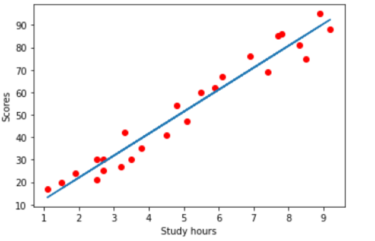
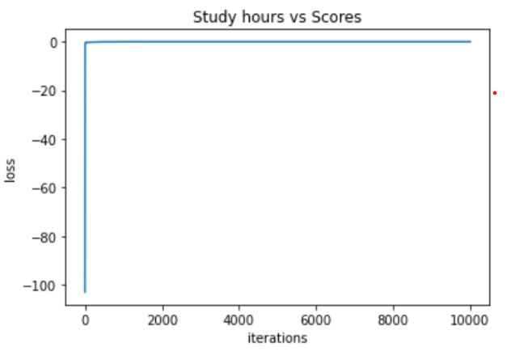

# Implementation-of-Linear-Regression-Using-Gradient-Descent

## AIM:
To write a program to implement the linear regression using gradient descent.

## Equipments Required:
1. Hardware – PCs
2. Anaconda – Python 3.7 Installation / Moodle-Code Runner

## Algorithm
1. Start the program
2. Import numpy , pandas and matplotlib
3. Read the file which store the data
4. Declare x as Hours and y as scores of the dataset
5. Using loop predict the data and find the MSE,dm,dc,y intercept,slope using the formulae
6. Find the best fit using the straight line formula
7. Display the data in graph using matplotlib libraries
8. Stop the program 

## Program:
```
/*
Program to implement the linear regression using gradient descent.
Developed by: Aakash.H
RegisterNumber: 212220040002 
*/
import numpy as np
import pandas as pd
import matplotlib.pyplot as plt
data = pd.read_csv("/content/student_scores .csv")
data.head()
data.isnull().sum()      #returns the no of miising values in the dataset
x = data.Hours
x.head()
y = data.Scores
y.head()
n = len(x)
m = 0
c = 0
L = 0.01
loss = []
for i in range(10000):
  ypred = m*x+c
  MSE = (1/n)*sum((ypred-y)*2)
  dm = (2/n)*sum(x*(ypred-y))
  dc = (2/n)*sum(ypred-y)
  c = c-L*dc
  m = m-L*dm
  loss.append(MSE)
  print(m,c)
y_pred = m*x+c
plt.scatter(x,y,color='red')
plt.plot(x,y_pred)
plt.xlabel("Study hours")
plt.ylabel("Scores")
plt.title("Study hours vs Scores")
plt.plot(loss)
plt.xlabel("iterations")
plt.ylabel("loss")
```
## Output:





## Result:
Thus the program to implement the linear regression using gradient descent is written and verified using python programming.
